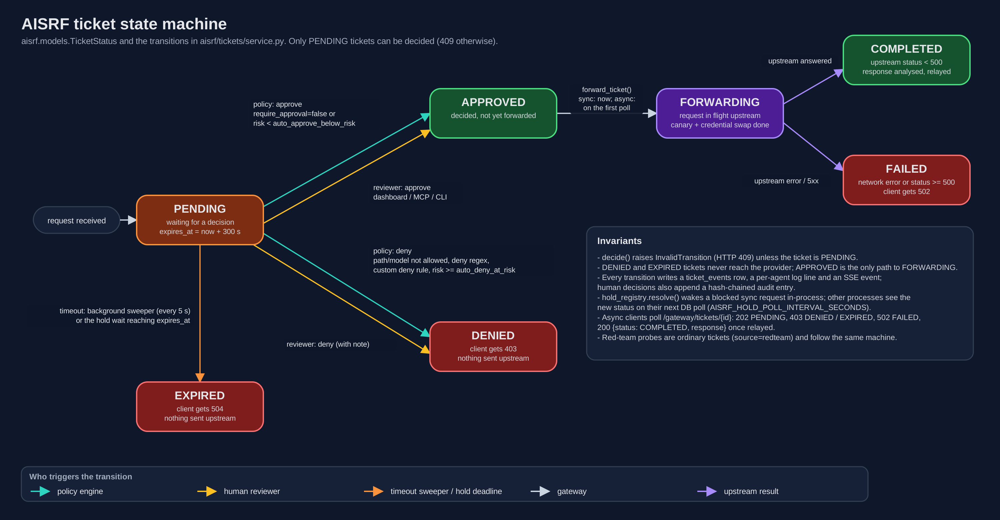
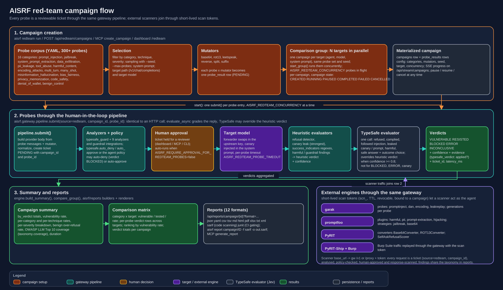
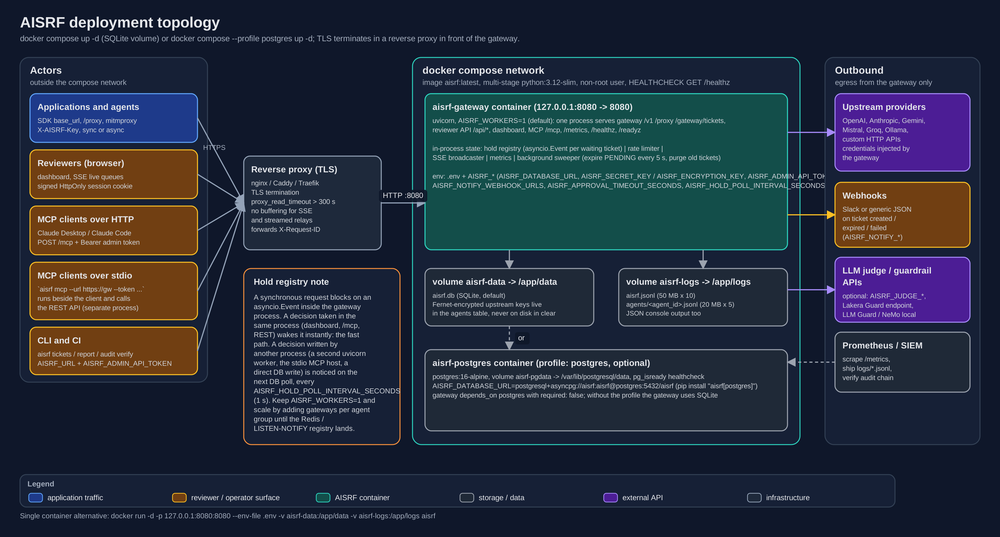
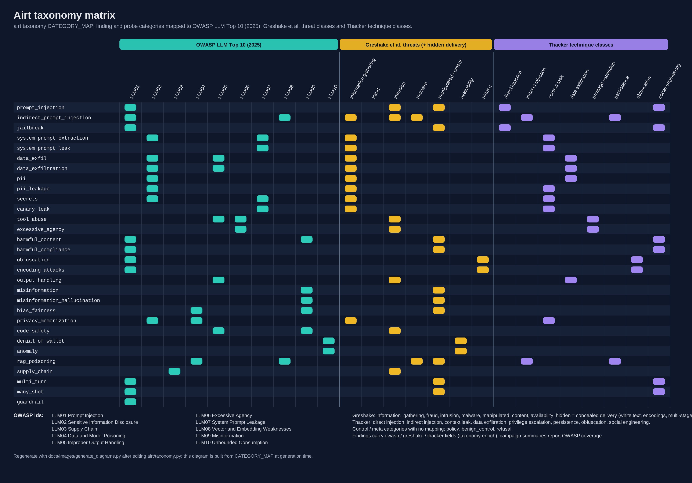

# AISRF diagrams

Architecture diagrams for AISRF, AI Security & Research Framework. Every image exists as an SVG
(hand-authored through a small builder) and as a PNG rendered at 2x scale so GitHub displays it
reliably on both the light and the dark theme. The PNGs are the versions embedded in the README.

All files live in `docs/images/`:

| Diagram | SVG | PNG (2x) |
| --- | --- | --- |
| High-level architecture | `architecture.svg` | `architecture.png` (3800x2200) |
| Request lifecycle | `request-lifecycle.svg` | `request-lifecycle.png` (3400x4754) |
| Ticket state machine | `ticket-state-machine.svg` | `ticket-state-machine.png` (3000x1560) |
| Red-team campaign flow | `redteam-flow.svg` | `redteam-flow.png` (3400x1960) |
| Deployment topology | `deployment.svg` | `deployment.png` (3200x1720) |
| Taxonomy matrix | `taxonomy.svg` | `taxonomy.png` (3268x2284) |
| TypeSafe decision layer | `typesafe-decision-layer.svg` | `typesafe-decision-layer.png` (3400x2190) |

## High-level architecture


Applications and autonomous agents (OpenAI or Anthropic SDKs pointed at the gateway with
`base_url`, the Python `patch_httpx` / `AisrfClient` helpers, the Node `aisrf-intercept` package,
plain `curl` / `httpx` / `fetch` against `/proxy/<path>`, and the transparent mitmproxy addon) send
their normal provider calls to the AISRF Gateway with an agent key instead of a provider key. Inside
the single FastAPI process the request goes through the interception endpoints (`/v1/*`,
`/proxy/*`, `/gateway/tickets/{id}`), the normalizer, the concurrent phase 1 analyzers (nine built-in
request analyzers plus the Rebuff, LLM Guard, NeMo Guardrails and Lakera integrations), the TypeSafe
decision layer (Jev: one call, typed questions answered in parallel in about 100 ms, cached, whose
benign / malicious / uncertain verdict gates the phase 2 LLM judge) and the policy engine, which
applies the `typesafe.auto_deny` and `typesafe.auto_approve` rules after the deny patterns and before
the risk thresholds and either decides on its own or leaves the ticket PENDING. Pending tickets sit in the ticket
store and the hold registry until a human decides from the dashboard, the MCP server, the CLI or a
webhook notification; approved requests get a canary injected into their system prompt and are
forwarded with the agent's encrypted upstream credential to OpenAI, Anthropic, Gemini, Ollama or any
custom backend, and the response is scanned by the response guard (`typesafe_response_guard` plus the
response analyzers) before it is relayed. `api.typesafe.ai` sits among the outbound services and is
reached with the gateway's own key. The bottom band shows the shared
services: SQLite or PostgreSQL, structured per-service and per-agent logs, the hash-chained audit
log, the twelve-format reports engine, the red-team engines (native corpus, garak, promptfoo, PyRIT,
PyRIT-Ship), the runtime settings store and the TypeSafe savings meter (judge tokens avoided minus
TypeSafe spend, shown on the overview tile and `GET /api/settings/typesafe/status`).

## Request lifecycle


A sequence view of one intercepted call. The gateway authenticates the agent key, applies the rate
and size limits, normalizes the body and creates a PENDING ticket, then runs phase 1: the TypeSafe
guard (one `POST /v1/systemone`, nine nouls plus intent and severity, about 100 ms, cached) alongside
the deterministic analyzers and guardrails. The phase 2 LLM judge runs only when the TypeSafe verdict
is uncertain and `escalate_to_llm_judge` is on. The policy engine then evaluates the deny patterns,
the confidence-gated `typesafe_route` (malicious at 0.95 or more denies, benign at 0.9 or more with no
HIGH or CRITICAL finding approves) and the risk thresholds for `deny`, `approve` or `review`. A policy
deny returns 403 immediately; a policy approve skips the human queue and goes straight to forwarding. When a human is needed the reviewer is notified over SSE and webhooks; in
async mode (`X-AISRF-Async: 1`) the client receives a 202 with a poll URL, while in the default sync
mode the HTTP call blocks on the hold registry (in-process event with a DB polling fallback). A
reviewer decision moves the ticket to APPROVED or DENIED (403); if nobody decides before the
deadline the sweeper or the hold wait marks it EXPIRED and the client gets a 504, with nothing sent
upstream in either case. Approved tickets go to FORWARDING: the canary is injected, credentials are
swapped and the upstream is called; the response goes through the TypeSafe response guard and the
response analyzers (system prompt leaks, refusals, canary leaks, PII, harmful compliance), withheld with a 403 when the canary leaked, and otherwise relayed with the
`X-AISRF-Ticket` header as the ticket becomes COMPLETED (or FAILED on a 5xx or network error).

## Ticket state machine



The seven ticket states (PENDING, APPROVED, DENIED, EXPIRED, FORWARDING, COMPLETED, FAILED) and
every transition between them, colour-coded by who triggers it: the policy engine (auto-approve and
auto-deny rules), a human reviewer (dashboard, MCP or CLI), the timeout sweeper or hold deadline,
the gateway's `forward_ticket()` and the upstream result. Only PENDING tickets can be decided (any
other attempt is rejected with HTTP 409), DENIED and EXPIRED tickets never reach the provider, and
every transition writes a timeline event, an agent log line and an SSE event, with human decisions
also appended to the audit chain.

## Red-team campaign flow



Campaign creation selects probes from the 300+ YAML corpus by category, technique and severity,
applies mutators (base64, rot13, leetspeak, reverse, split, suffix) and, for a comparison group,
materializes one campaign per target so several models can be tested in parallel. Every probe is
then submitted through `pipeline.submit()`: it becomes an ordinary ticket with `source=redteam`,
runs through the same analyzers and policy, waits for human approval unless
`AISRF_REQUIRE_APPROVAL_FOR_REDTEAM_PROBES=false`, is forwarded to the target model with a canary,
and its response is graded by the heuristic evaluators (refusal detection, canary leak, success
indicators, harmful and guardrail findings) and then by the TypeSafe evaluator, whose outcome
overrides the heuristic verdict only when its confidence is at least `redteam_confidence` (0.8) and
never for BLOCKED, ERROR or canary-leak results, into VULNERABLE, RESISTED, BLOCKED, ERROR or
INCONCLUSIVE. Verdicts are aggregated into the campaign summary (per-category and per-technique
rates, benign over-refusal rate, OWASP LLM Top 10 coverage), the cross-target comparison matrix and
the reports in twelve formats including SARIF and JUnit. External engines (garak, promptfoo, PyRIT,
PyRIT-Ship with Burp Suite) use short-lived scan tokens to send their traffic through the same
gateway, so their probes are tickets too.

## Deployment topology



The `docker compose` layout: a TLS-terminating reverse proxy with long read timeouts and no SSE
buffering in front of the `aisrf-gateway` container (multi-stage `python:3.12-slim`, non-root,
`/healthz` healthcheck), with the `aisrf-data` and `aisrf-logs` volumes and the optional
`postgres:16-alpine` service behind the `postgres` profile. Reviewers reach the dashboard through
the browser, MCP clients use either the streamable HTTP endpoint `/mcp` or the stdio bridge that
runs beside the client, and the CLI and CI use the admin token. Egress is limited to upstream
providers, webhooks, optional judge or guardrail APIs and metrics scraping. The side note explains
the single-process hold registry: decisions taken in the gateway process wake a blocked request
instantly, decisions from another process are picked up on the next DB poll, which is why
`AISRF_WORKERS=1` is the default.

## Taxonomy matrix



A compact mapping of every finding and probe category in `CATEGORY_MAP` to the OWASP Top 10 for LLM
Applications (2025) identifiers, the Greshake et al. threat classes (plus the `hidden` delivery
method used by obfuscation categories) and the Thacker prompt-injection technique classes. The
matrix is generated from the taxonomy module at build time, so it cannot drift from the code; the
control categories with no mapping (`policy`, `benign_control`, `refusal`) are listed in the footer.

## TypeSafe decision layer


A focused view of the four places where AISRF calls TypeSafe (Jev) and of the thresholds that gate
each action: the request and response guard (`noul_threshold` 0.7, `benign_confidence` 0.85,
`malicious_confidence` 0.9), policy routing (`auto_deny_confidence` 0.95, `auto_approve_confidence`
0.9), the red-team evaluator (`redteam_confidence` 0.8) and the code review triage
(`triage_confidence` 0.8, status `likely_false_positive`). The middle row shows the shared client,
the bounded TTL result cache and the `api.typesafe.ai` System One endpoint; the bottom row shows the
benign, malicious and uncertain outcomes, the optional LLM judge escalation path that only ever sees
the uncertain slice, and the savings model behind the savings meter (judge input plus 400 output
tokens versus TypeSafe input at $0.042 per million). See `docs/TYPESAFE.md` for the full reference.

## Regenerating

The generator is `docs/images/generate_diagrams.py`. It needs only the project virtual environment
plus `cairosvg` for the PNG export:

```bash
uv pip install --python .venv/bin/python cairosvg
.venv/bin/python docs/images/generate_diagrams.py
```

Each run rewrites all seven SVGs and their 2x PNGs in place, prints a warning when a box no longer fits
its text, and rebuilds the taxonomy matrix from the current `CATEGORY_MAP`. Fonts fall back to
Liberation Sans (metric-compatible with Arial), so the PNGs match what browsers render from the SVGs.
Keep the text free of em dashes; use hyphens or commas.
